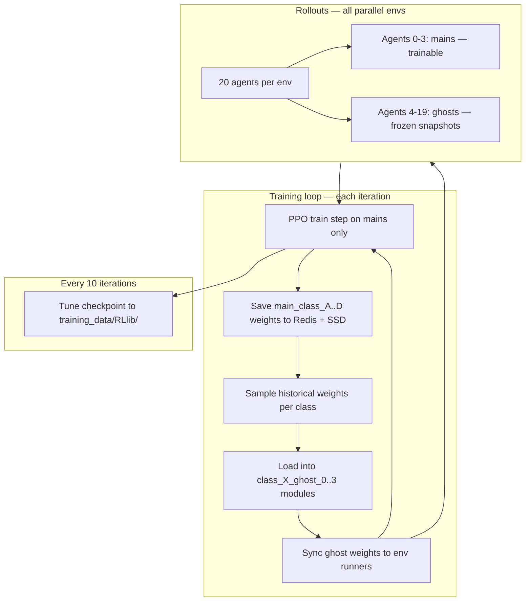

# Ghost Model League — Training Architecture

Last updated: 2026-06-14

This report documents the **ghost-league training loop**: frozen historical opponents sampled from Redis, wired into Ray RLlib PPO training via `LeagueBootstrapCallback`.

---

## Executive summary

The project intends to train four **main** policies (`main_class_A` … `main_class_D`) against sixteen **ghost** policies that play frozen weights from past training iterations, stored in Redis. Ghosts should be **reinitialized with new historical weights** so mains never overfit to a static opponent pool.

**The full league loop is implemented.** Redis is pre-seeded once via a CLI, hydrated from SSD on cold start, and the training callback saves mains + refreshes ghosts every iteration.

| Capability | Intended | Current state |
|------------|----------|---------------|
| Save main weights to Redis each iteration | Yes | **Implemented** — `on_train_result` → `save_mains_and_refresh_ghosts` |
| Pre-seed Redis from mains (one-time) | Yes | **Implemented** — `python rl/runtime/train.py seed` seeds `policy:{class}:0..49` + SSD export + provenance metadata |
| SSD persistence / cold-start hydrate | Yes | **Implemented** — Redis bind mount + `hydrate_redis_from_disk` from `training_data/redis/` |
| Load ghost weights from Redis | Yes | **On algorithm init** via callback + `load_random_league` |
| Refresh ghosts during `tuner.fit()` | Yes (per iteration) | **Implemented** — `on_train_result` refreshes ghosts every `DIEP_GHOST_REFRESH_INTERVAL` iterations (default 5; mains still save every iteration) |
| Different ghost lineup per parallel env | Desired by user | **Not supported** — 16 shared policy IDs globally (see Option B) |
| RLlib new-stack (RLModule) compatibility | Required | **`random_pick.py` + `module_state.py` updated** |
| Post-`fit()` ghost load via `ResultGrid` | No | **Removed** from `ray_code.py` |
| RLlib training resume checkpoints | Yes | **Implemented** — Tune checkpoints every 10 iters to `diepcustom/training_data/RLlib/` |
| Resume after stopped run | Yes | **`python rl/runtime/train.py resume`** → fail-closed metadata validation + `Tuner.restore` |

### Two-track persistence (league vs RLlib)

Training uses **two separate SSD/Redis tracks**. They must be **restored together** for correct ghost behavior.

| Track | Purpose | Location | Frequency |
|-------|---------|----------|-----------|
| **League (lean)** | Ghost opponent weights | Redis + `diepcustom/training_data/redis/` | Every iteration (`LeagueBootstrapCallback`) |
| **RLlib (bulky)** | Resume training after interruption | `diepcustom/training_data/RLlib/` | Every 10 iterations (Tune `CheckpointConfig`) |

**Fresh start:** `python rl/runtime/train.py train` (auto-starts Redis and hydrates/seeds as needed).

**Resume:** `python rl/runtime/train.py resume` — starts Redis, validates RLlib + league provenance metadata, then restores RLlib algorithm state via `Tuner.restore`. On init, `LeagueBootstrapCallback` hydrates Redis if empty and reloads ghosts. Resuming RLlib alone with a stale/empty league is refused by default.

RLlib checkpoints restore learner/main weights and training iteration; they do **not** include mid-episode Diep C++ world state (env runners reset episodes on resume).

---

## Intended design

### Game layout (20 agents)

Each environment instance runs 20 agents:

| Agent index | Role | Policy ID | Trained? |
|-------------|------|-----------|----------|
| 0–3 | Main fighters (one per class) | `main_class_A` … `main_class_D` | **Yes** |
| 4–19 | Ghost opponents | `class_{A\|B\|C\|D}_ghost_{0..3}` | **No** (inference only) |

Mapping is centralized in `league_initialization/constants.py`:

```python
from league_initialization.constants import policy_id_for_agent

def policy_mapping_fn(agent_id, episode, worker, **kwargs):
    return policy_id_for_agent(agent_id)
```

Each class has four ghost **slots**. Each slot should hold a randomly sampled snapshot of a past main policy for that class, biased toward recent iterations.

### Redis league memory

`RedisModelStore` (`model_store.py`) defines the persistence contract:

- **Key format:** `policy:{char_class}:{iteration}` (e.g. `policy:A:42`)
- **Value:** safetensors-serialized PyTorch `state_dict`
- **Rolling window:** keeps the last 50 iterations per class (`window_size=50`)
- **Optional SSD export:** every iteration via `league_loop` (independent of `snapshot_every`); `model_store` also supports periodic export every 10 iterations for manual saves

After each training iteration, the four **main** policies should be written to Redis. Ghost policies should **read** from that pool, not receive gradients.

### Sampling strategy

`random_pick.py` implements `weighted_recent_sample(keys, k, decay=0.90)`:

- Higher iteration numbers (more recent checkpoints) get exponentially higher selection weight.
- For each class, pick 4 distinct Redis keys and assign them to ghost slots 0–3.

This gives a **moving league**: mains train against a mix of recent and older selves, with recency bias.

### User requirement: reinitialize ghosts frequently

The desired behavior (as stated in design discussion):

> For every env, ghosts should be reinitialized with new weights from the past.

This implies ghosts should **not** stay fixed for the entire 2000-iteration run. At minimum, weights should be resampled on a recurring schedule (per iteration, per episode reset, or per parallel env instance). The strictest reading — **different ghost lineups per parallel env** — requires additional architecture beyond the current 16-policy setup.

---

## Current architecture

### Training entry point: `ray_code.py`

1. Registers `diepcustom_headless` (20-agent PettingZoo env via `DIEP_ENV_CONFIG`).
2. Probes compute via `resource_compute` and builds `PPOConfig` with 4 mains + 16 ghosts (`DiepPolicy` RLModule).
3. Wires `LeagueBootstrapCallback` for league init + per-iteration save/refresh.
4. Runs `tune.Tuner("PPO", ...).fit()` for 2000 iterations.
5. RLlib checkpoints every **10** iterations to `diepcustom/training_data/RLlib/`.
6. Resume: `python rl/runtime/train.py resume` → metadata validation + `Tuner.restore` (requires Redis + league SSD from same run).

### League callback (`LeagueBootstrapCallback`)

| Hook | Behavior |
|------|----------|
| `on_algorithm_init` | Hydrate Redis from SSD if empty; error if still empty; load ghosts from Redis |
| `on_train_result` | Save mains to Redis+SSD; refresh all ghost modules; sync env runners once |

### Parallelism model

```
num_env_runners × num_envs_per_env_runner
```

All env instances share **16 global ghost policy IDs**. Ghost weights refresh globally each iteration (Option A), not per-env.

### Files involved

| File | Role |
|------|------|
| `train.py` | Canonical doctor/Redis/seed/smoke/train/resume CLI |
| `training_runtime.py` | Shared Tune job and multi-agent config helpers |
| `ray_code.py` | Backward-compatible fresh training entry point |
| `resume_from_checkpoint.py` | Fail-closed metadata validation + `Tuner.restore` |
| `training_metadata.py` | Run/league provenance hashes and validation |
| `league_initialization/callback.py` | League init + per-iteration loop |
| `league_initialization/league_loop.py` | `save_mains_and_refresh_ghosts` |
| `league_initialization/seed_league_cache.py` | One-time Redis + SSD seed CLI |
| `league_initialization/disk_store.py` | Hydrate/export league weights on SSD |
| `random_pick.py` | Weighted Redis sampling + RLModule ghost load |
| `model_store.py` | Redis safetensors store (league track only) |
| `DiepModelConfig.py` | Shared `DiepPolicy` RLModule for all 20 policies |

### SSD layout (`diepcustom/training_data/`)

| Path | Purpose |
|------|---------|
| `redis/` | League weight exports (`{class}/iter_{N}.safetensors.zst`) + `league_metadata.json` |
| `redis-server/` | Redis Docker bind mount (AOF-only; RDB snapshots disabled to avoid duplicating ~1.8 GB of league bytes) |
| `RLlib/` | Tune checkpoints and per-run `run_metadata.json` for training resume |

---

## Remaining limitations

1. **Per-env ghost diversity** — not implemented; all parallel envs share the same 16 ghost modules (see Option B below).
2. **Mid-episode world restore** — RLlib checkpoints do not include Diep C++ simulation state; env runners reset episodes on resume.
3. **League + RLlib restore together** — resuming RLlib without matching Redis/league SSD yields incorrect ghosts.

---

## Resolved historical gaps

These issues existed in early drafts and are now fixed:

- Post-`fit()` ghost load via `ResultGrid` (wrong timing, wrong object) — **removed**
- Deprecated `get_policy().model` API — **replaced** with `module_state.py` RLModule helpers
- No Redis writes during training — **fixed** via `on_train_result`
- Empty Redis cold start — **fixed** via seed CLI + SSD hydrate
- Runtime bootstrap from mains — **replaced** by explicit one-time seed CLI

---

## Per-env ghost options

RLlib shares one weight set per policy ID across all workers and sub-envs. `policy_mapping_fn` selects a policy ID; it does **not** load weights.

#### Option A — Global league refresh (implemented)

Keep 16 ghost policy IDs. `LeagueBootstrapCallback` resamples from Redis every iteration and syncs once to all env runners. All parallel envs share the same lineup at any moment.

#### Option B — Per-env ghost policies (not implemented)

Create separate policy IDs per env instance, e.g. `class_A_ghost_{env_idx}_{slot}` for each of `num_env_runners × num_envs_per_env_runner` envs. Policy count explodes; highest memory/sync cost.

#### Option C — Episode-level sampling (not implemented)

Sample weight keys at episode reset and inject via custom connector plumbing. Highest engineering cost.

---

## Cold-start and persistence

Package: [`league_initialization/`](league_initialization/)

**Pre-seed (one-time, before first training run):**

```bash
cd diepcustom
python rl/runtime/train.py seed --count 50
```

`seed_league_cache` builds a minimal PPO algorithm, copies each `main_class_{X}` RLModule state into Redis iterations **0–49**, and exports every entry to `diepcustom/training_data/redis/{class}/iter_{N}.safetensors.zst`, and writes `league_metadata.json`.

**On training start, `LeagueBootstrapCallback.on_algorithm_init`:**

1. If Redis is empty, `hydrate_redis_from_disk(store)` repopulates from SSD export.
2. If still empty, raise `RuntimeError` pointing to the seed CLI.
3. `load_random_league(algorithm, char_class)` for A–D — sample 4 ghost slots from Redis into ghost RLModules.

**Per iteration, `LeagueBootstrapCallback.on_train_result`:**

1. `save_mains_to_redis` — write all four mains at `store.next_iteration()` and export to SSD.
2. `refresh_all_ghosts` — resample 4 ghosts per class from Redis; sync env runners once.

| Phase | Redis per class | Content |
|-------|-----------------|---------|
| After seed CLI | `policy:{class}:0..49` | Identical to `main_class_{class}` at seed time |
| First real save | `store.next_iteration()` → **50** | Evicts iteration 0 via rolling window |
| After 50 real saves | Iterations 50–99 | Seed entries fully phased out |

`weighted_recent_sample` returns `[]` on empty input (safety guard). SSD persistence (`training_data/redis-server` bind mount + `training_data/redis` exports) survives container restarts.

**Redis persistence policy:** the container runs `redis-server --appendonly yes --save ""` so only the AOF lives on disk. RDB snapshots are disabled because the league export tree under `training_data/redis/` already serves as the hydrate fallback. After upgrading an existing install, stop the container and delete `training_data/redis-server/dump.rdb` once; subsequent runs will not recreate it.

### Two-track persistence

| Track | Purpose | Location | Frequency |
|-------|---------|----------|-----------|
| **League (lean)** | Ghost opponent weights (int8 + zstd) | Redis + `training_data/redis/` | Every iteration |
| **RLlib (bulky)** | Resume training (main weights only, no optimizer) | `training_data/RLlib/` | Every 10 iterations, keep 10 |

Resume training:

```bash
cd diepcustom
python rl/runtime/train.py resume          # latest experiment
python rl/runtime/train.py resume --resume-path /path/to/experiment
```

**Critical:** Resume validates `run_metadata.json` and `league_metadata.json` and fails closed on missing/stale metadata. RLlib checkpoints do not restore mid-episode Diep C++ world state.

**Optimizer state on resume:** `DiepPPO.save_checkpoint` excludes the optimizer component (`learner_group/learner/optimizer`) along with all ghost RLModules. Adam state therefore reinitializes on every restore, which produces a brief noise-up window on the first ~few iterations after resume in exchange for ~74 MB of checkpoint disk. Main weights and Tune iteration counters are preserved, so this is a pure optimizer warm-up cost, not a regression in the policy.

---

## Key namespace and weight format

- Redis keys: `policy:{class}:{iteration}` — consistent between `random_pick.py` and `RedisModelStore`.
- All 20 policies use `DiepRLSpec` → `DiepPolicy` (RPPO + LSTM). Saves must be full RLModule `state_dict` blobs compatible with `DiepPolicy`, not partial encoder dumps.
- Weight injection uses `module_state.py` helpers on the new RLModule API (not deprecated `get_policy().model`).

---

## Data flow (current)



---

## Quick start

```bash
cd diepcustom
python rl/runtime/train.py doctor
python rl/runtime/train.py seed --count 50   # first time only
python rl/runtime/train.py train             # fresh training
python rl/runtime/train.py resume            # safe resume
cd ts-server && npm run test:training-smoke
```

See [TRAINING.md](../../TRAINING.md) for the canonical workflow and artifact layout.

---

## File reference summary

| Location | Role |
|----------|------|
| `train.py` | Canonical doctor/Redis/seed/smoke/train/resume CLI |
| `training_runtime.py` | Tune job and multi-agent config helpers |
| `ray_code.py` | Backward-compatible fresh training entry point |
| `resume_from_checkpoint.py` | Safe `Tuner.restore` resume entry point |
| `training_metadata.py` | Run/league provenance metadata and validation |
| `league_initialization/callback.py` | Hydrate, seed ghosts, per-iteration save/refresh |
| `league_initialization/league_loop.py` | `save_mains_and_refresh_ghosts` |
| `random_pick.py` | Weighted Redis sampling + RLModule ghost load |
| `model_store.py` | Redis safetensors store (league track) |
| `module_state.py` | RLModule get/set/sync helpers |
| `DiepModelConfig.py` | Shared `DiepPolicy` RLModule for all 20 policies |

---

## Conclusion

The ghost league loop is **wired into RLlib training** via `LeagueBootstrapCallback`: mains save to Redis/SSD each iteration, ghosts resample from historical weights, and env runners sync globally (Option A). RLlib checkpoints on a separate track enable training resume but not per-env ghost diversity or mid-episode world restore.
